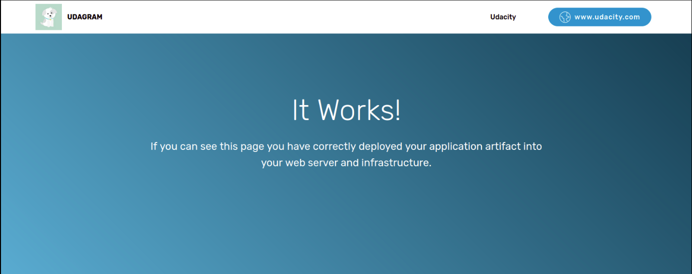

## Project description

This is an instagram clone called Udagram. Udagram developers can push the latest version of their code in a zip file located in a public S3 Bucket. The servers will copy the code in the S3 Bucket and deploy it into the Apache hosting document root folder.

## Infrastructure diagram

## Deployment

#### Prerequisite

The following resources are required for deploying Udagram

- AWS account
- A Linux based local system with aws cli installed and configured the aws cli profile
- A Linux based local system with git installed

#### Steps

1. git clone this repository

2. cd c3

3. ./create.sh <network stack name> network-s3.yml parameters-s3.json

4. ./create.sh <server stack name> servers-s3.yml parameters-s3.json

   [^1]: The AWS region that the infrastructure deploy is in us-west-2
   [^2]: When creating the infrastructure in step 4, you should allow step 3 to finish before  executing it. The status of the execution can be viewed in CloudFormation section in the AWS management console

## Result

The public URL of Udagram is located in the output section of the server stack in CloudFormation by a variable called **ApplicationLoadBalancerDNSName**

The following will display if the deployment is successful

